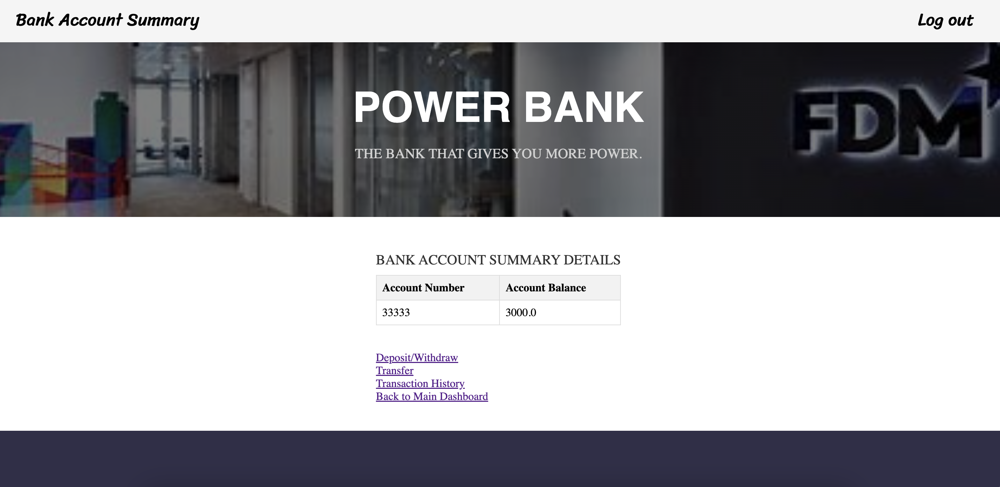
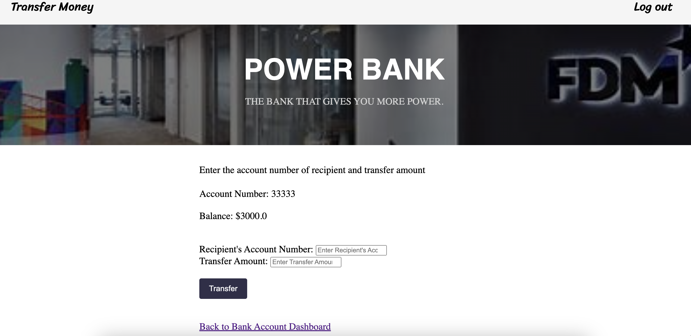

# Mock website of a fictional bank called PowerBank
TechStack: Spring Boot, Java, HTML, CSS, SQL, REST API, BootStrap   
Architecture: MVC Framework, Controller-Service-Repository Pattern

## Getting started
You need to have the following downloaded and set up:
- Any database management system (MySQL is recommended)

## Installation
1. Clone this project
2. Add a new file **application.properties** into *src/main/resources* with the following content:
- Edit the necessary information in the [ ] square brackets
```
server.port=9001

### MYSQL DATABASE ###
spring.datasource.driver-class-name=com.mysql.cj.jdbc.Driver
spring.datasource.url=[your SQL URL eg: jdbc:mysql://localhost:3306/powerbank]
spring.datasource.username=root
spring.datasource.password=[your mySQL password]
spring.jpa.database=mysql
#spring.jpa.hibernate.ddl-auto=update
spring.jpa.hibernate.ddl-auto=create-drop
spring.jpa.show-sql=true
spring.jpa.properties.hibernate.format-sql=true
spring.jpa.defer-datasource-initialization=true
spring.sql.init.mode=always
```
3. Go to src/main/java/fdmgroup/com/powerbank/PowerBankApplication.java to run the project
4. Go to http://localhost:9001/ on your browser

## Navigating the website 
**User Login**   
- Login: Mock user details can be found in *src/main/resources/data.sql* eg. name: johndoe password: 123   
- Register: You may try to register an account but **DO NOT use your real name and password**   
   

**Dashboard**
- List of all bank accounts and cards
  

**Bank Account Management**
- Account Details
  - Account Number and balance
    
- Deposit/ Withdraw
  - Account balance as the withdrawal limit
      
- Transfer
  - Recipient account must be valid
  - Account balance as the transfer limit
      
- Past Transactions
  - Display the time, type, amount and counter party’s account number if applicable
      

**Credit Card Management**
- Card Details
  - Cashback Rate applied to credit card purchases
  - Current Balance is kept up-to-date
  - Statement Amount generated at the end of every billing cycle (end of the month)
      
- Pay Bills
  - Pay with money in Bank Account
  - Generate transaction records for both bank account and credit card
       
- Instalment Plans
  - Interest-free monthly instalment plan
  - Display active installments under the respective credit card
      
- Past Transactions
  - Display the time, type, merchant name and code, and amount
      

## Authors and acknowledgment
Venessa Foong, Andrew Huang, Dayan Melisov, Jasmine Pak, Randy Chng, Ryan Tan, Sean Ong

## Project status
**Development is suspended**   
Features to include in the future:
- Spring Security
- Enhance UI UX
